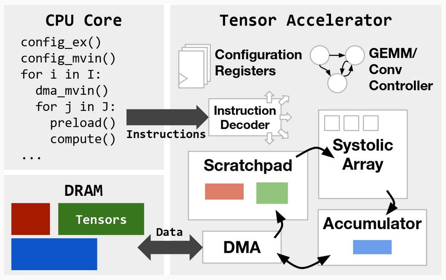
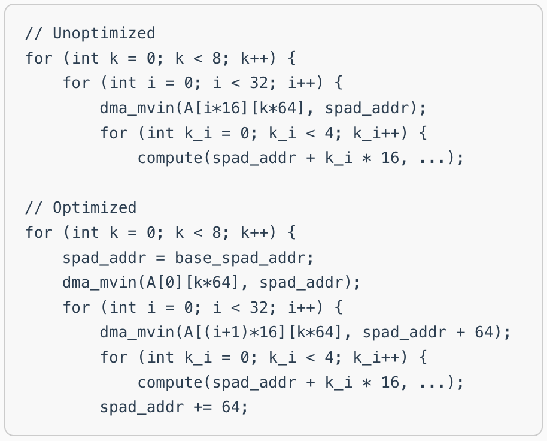
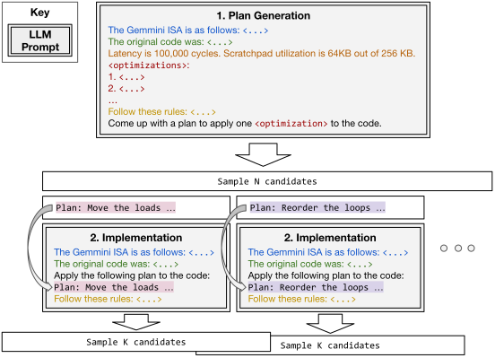

 <div align="center">
    
    
    
</div> 

# Autocomp: LLM-driven Code Optimization for Tensor Accelerators

[](https://arxiv.org/abs/2505.18574)
[](https://charleshong3.github.io/blog/autocomp.html)

Welcome to the code repository of **Autocomp**. Check out our introductory [blog post](https://charleshong3.github.io/blog/autocomp.html)!

**Paper**: [**Autocomp: LLM-Driven Code Optimization for Tensor Accelerators**](https://arxiv.org/abs/2505.18574)

**Authors**: [Charles Hong](https://charleshong3.github.io/), [Sahil Bhatia](https://x.com/sahilb17), [Alvin Cheung](https://people.eecs.berkeley.edu/~akcheung/), and [Yakun Sophia Shao](https://people.eecs.berkeley.edu/~ysshao/) (UC Berkeley)

Note that this repository is still under construction.

## Setup

[Chipyard](https://chipyard.readthedocs.io/en/latest/) and [FireSim](https://docs.fires.im/en/1.20.1/) are needed to replicate experiments with Gemmini (you can also set `"simulator"` in `search.py` to `"spike"`, but this will only optimize instruction counts, not cycle counts).

### Chipyard

First, clone [Chipyard](https://github.com/ucb-bar/chipyard) and check out commit `dbc082e2206f787c3aba12b9b171e1704e15b707`. Then, run Chipyard's setup script as described in the Chipyard docs, and `source` the created environment.

### FireSim

Next, make sure FireSim is set up and ready to run. You will probably need to run `firesim managerinit --platform <your_platform>` and configure files such as `firesim/deploy/config_hwdb.yaml` and `firesim/deploy/config_runtime.yaml`. Make sure to use a FireSim bitstream for your FPGA platform with the Gemmini configuration you want to use. You will also need to set up a FireSim workload `json` file with `"benchmark_name": "gemmini"`. An example of files we used is [here](https://github.com/charleshong3/auto-comp-firesim-files). 

Under `firesim/deploy/workloads`, create a directory called `gemmini`. This will be pointed to by `config_runtime.yaml` and `autocomp/search/hardware_eval.py` within Autocomp.

### Gemmini
The last dependency is [Gemmini](https://github.com/ucb-bar/gemmini), which has already been cloned as a Chipyard subrepository. Navigate to `chipyard/generators/gemmini/software/gemmini-rocc-tests` and check out branch `auto-comp-v2`.

In order to collect scratchpad/accumulator utilization stats, you will need to use our modifications to Spike (the RISC-V ISA simulator). Navigate to `chipyard/generators/gemmini/software/libgemmini` and check out branch `auto-comp`. Then, run the following:
```sh
make
make install
```

### Autocomp
Finally, set up Autocomp and its Python dependencies: ``pip install -e .``

In `autocomp/search/hardware_eval.py`, you will need to update at least one of the paths at the top of the file. By default, you will have set up Gemmini's "default" int8, 16x16 systolic array configuration, in which case you can set `INT8_16PE_CHIPYARD_PATH` to point to your Chipyard directory.

### Note for AWS F1 users
The instruction above have been confirmed to work on a machine with a local Xilinx Alveo U250 FPGA. Due to the upcoming deprecation of AWS F1 instances, FireSim support for AWS is spotty at the moment, but we have confirmed that some configurations work with FireSim-as-top with older versions (such as [this one](https://github.com/charleshong3/firesim-dosa)). However, there may be version mismatches (for example with Gemmini software) if you check out old versions of FireSim, so proceed with caution.

## Usage

`autocomp/search/search.py` is the entry point for running Autocomp optimization. Various parameters such as models used, beam size, number of plans, number of code implementations, dropout, etc. can be configured here.

### TinyMPC
TinyMPC kernels (stored under the name `admm-multifunction`) require manual changes to the code. Specifically, `autocomp/search/llm_agent.py` should be changed to import `prompts.isa_prompt_admm` instead of `prompts.isa_prompt_conv`. Also, an FP32 4x4 Gemmini configuration should be used (requires building a new bitstream with Gemmini's FP32DefaultConfig).

## Repository Structure

**`autocomp/`** - Core Autocomp code.
- `search/` - Core search and optimization infrastructure
  - `search.py` - Main search algorithm implementation. Implements the beam search described in the paper. Change search parameters within this file.
  - `llm_agent.py` - LLM agents for planning and code optimization. Implements the two prompt phases described in the paper. The optimization menu is defined within this file.
  - `llm_ensemble.py` - Wrapper around LLM agents that enables calls to be split between multiple agents.
  - `hardware_eval.py` - Hardware evaluation utilities for Gemmini. Must configure paths to Chipyard/FireSim/Gemmini here.
  - `prob.py` - Wrapper for tests (parsed from the `tests/` directory) that edits the test file and appends LLM-generated code in order to test it.
  - `code_repo.py` - Abstraction for managing code candidates generated during optimization.
- `common/` - Shared utilities and helper functions
  - `llm_utils.py` - LLM interaction utilities. Works with OpenAI, Anthropic, and Google Gemini. Implements parallel calls for OpenAI.
  - `my_logging.py` - Custom logging functionality.
  - `utils.py` - General utility functions.

**`prompts/`** - Contains various prompts imported by `autocomp/search/llm_agent.py`.
- `isa_prompt_conv.py` - Accelerator ISA section of the prompt, used for GEMM and convolution.
- `isa_prompt_admm.py` - Accelerator ISA section of the prompt, used for TinyMPC.
- `opt_system/` - Prompts and examples used for optimization
  - `gemmini_rules.py` - Rules section of the prompt (helps constrain output and encourage functional correctness).
  - `plan_prompt.py` - Planning phase prompt (note that implementation prompt is entirely contained within `autocomp/search/llm_agent.py` above).
  - `tiling_example.py` - Tiling optimization example.
  - `if_example.py` - Conditional optimization example (from convolution).
  - `if_example_matmul.py` - Conditional optimization example (from GEMM).

**`sols/`** - Contains baseline code for the benchmarks in the paper.
- `exo/` - Exo unoptimized and optimized baseline code for the GEMM benchmarks in the paper. `sol{id}_exo_baseline.c` is the unoptimized code and is used by `autocomp/search/search.py` as the starting code fro optimization.
- `gemm/` - Additional GEMM benchmarks used for schedule reuse. No hand-optimized code available.
- `exo-conv/` - Exo unoptimized and optimized baseline code for the convolution benchmarks in the paper.
- `admm-multifunction/` - TinyMPC unoptimized and optimized baseline code. Only problem IDs 1 and 2 are used in the paper. Run with FP32 4x4 Gemmini.

**`tests/`** - Contains test cases corresponding to `sols/` above.
- `exo/`, `gemm/`, `exo-conv/`, `admm-multifunction/` - Test cases corresponding to directories in `sols/` above.

## Citations
```
@misc{hong2025autocomp,
      title={Autocomp: LLM-Driven Code Optimization for Tensor Accelerators}, 
      author={Charles Hong and Sahil Bhatia and Alvin Cheung and Yakun Sophia Shao},
      year={2025},
      eprint={2505.18574},
      archivePrefix={arXiv},
      primaryClass={cs.CL},
      url={https://arxiv.org/abs/2505.18574}, 
}
```
