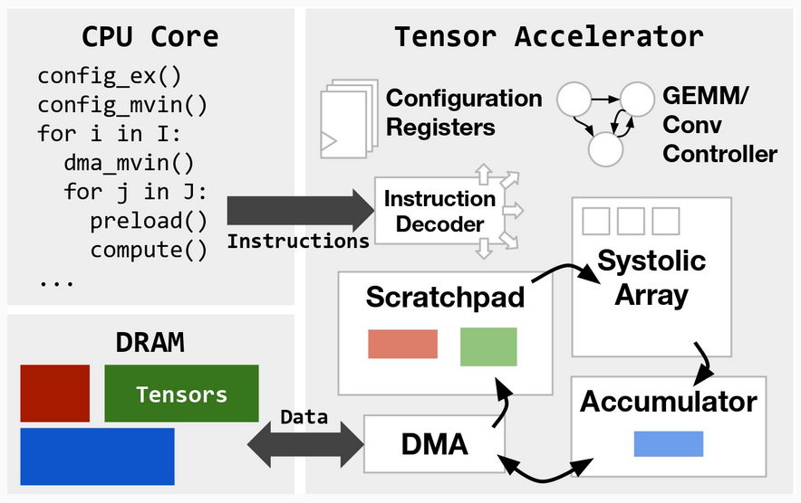
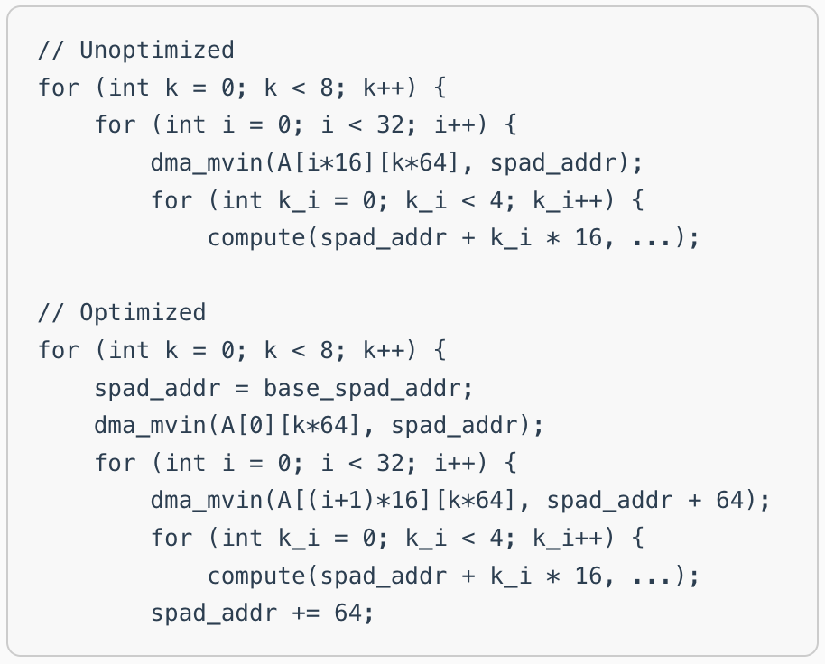
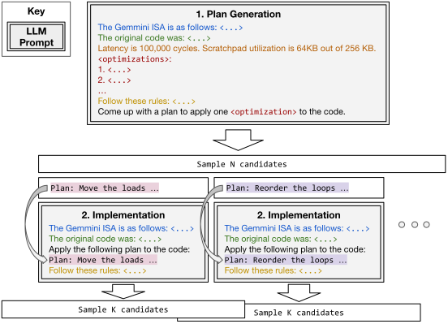

 <div align="center">
    
    
    
</div> 

# Autocomp: AI Code Optimizer for Tensor Accelerators

[](https://arxiv.org/abs/2505.18574)
[](https://charleshong3.github.io/blog/autocomp.html)

Welcome to the code repository of **Autocomp**. Check out our introductory [📝 blog post](https://charleshong3.github.io/blog/autocomp.html)!

**Update (9/22/2025)**: Added code/documentation for setting up CUDA/KernelBench backend, plus code for RVV optimization. Check out [📝 blog post 2](https://charleshong3.github.io/blog/autocomp_update.html) for more details.

**Update (11/3/2025)**: Added code/documentation for setting up Trainium backend.
Check out [📝 blog post 3](https://charleshong3.github.io/blog/autocomp_trainium.html) for more details.

**📚 Paper**: [**Autocomp: A Powerful and Portable Code Optimizer for Tensor Accelerators**](https://arxiv.org/abs/2505.18574)

**✏️ Authors**: [Charles Hong](https://charleshong3.github.io/), [Sahil Bhatia](https://x.com/sahilb17), [Alvin Cheung](https://people.eecs.berkeley.edu/~akcheung/), and [Yakun Sophia Shao](https://people.eecs.berkeley.edu/~ysshao/) (UC Berkeley)

# ⚙️ Setup

## Backend Setup

Currently supported backends:
- Gemmini ([gemmini_setup.md](autocomp/backend/gemmini_setup.md))
- Trainium ([trn_setup.md](autocomp/backend/trn_setup.md))
- CUDA via KernelBench ([kb_setup.md](autocomp/backend/kb_setup.md))

Partially supported backends:
- RISC-V Vector (RVV) on Canaan Kendryte K230. See `k230` branch for code. As the implementation is very hacky, we do not currently recommend using this backend.

## LLM Endpoint Setup

Depending on the specific models you want to use, you will need to define the appropriate environment variables (e.g., `OPENAI_API_KEY`), or create a custom `openai_key.py` (or `anthropic_key.py`, `gemini_key.py`, `together_key.py`) file in `autocomp/common/openai_key.py`, which defines the variable `key` as follows:

```python
key = "YOUR_OPENAI_API_KEY"
```

## 🚀 Usage

`autocomp/search/search.py` is the entry point for running Autocomp optimization. Various parameters such as backend, models used, beam size, number of plans, number of code implementations, dropout, etc. can be configured here.

Notable parameters:
- `backend`: The hardware backend to use. Currently supported backends are `gemmini`, `trn`, and `cuda`.
- `models`: The list of models to use. For example, `o3-mini`, `gpt-4o`. A variety of endpoints (OpenAI, Anthropic, Gemini, Together) are supported but routing is somewhat hacky; see `autocomp/common/llm_utils.py`.
- `simulator`: The evaluation method to use.
  - For Gemmini, `spike` (only optimizes instruction counts, not cycle counts) or `firesim`
  - For Trainium, `trn`
  - For CUDA,`kernelbench`
- `iterations`: The number of iterations to run.
- `search_strategy`: The search strategy to use. Currently only `beam` is supported.
- `prob_type`: The problem type to use.
  - For Gemmini, `gemm`, `conv`, or `admm-multifunction`.
  - For Trainium, `trn-tutorial` or `trn-advanced`.
  - For CUDA, `kb-level1`, `kb-level2`, `kb-level3`, or `kb-level4`.
- `prob_id`: The problem ID to use.

## 📁 Repository Structure

**`autocomp/`** - Core Autocomp code.
- `search/` - Core search and optimization infrastructure
  - `search.py` - Main search algorithm implementation. Implements the beam search described in the paper. Change search parameters within this file.
  - `llm_agent.py` - LLM agents for planning and code optimization. Implements the two prompt phases described in the paper. The optimization menu is defined within this file.
  - `llm_ensemble.py` - Wrapper around LLM agents that enables calls to be split between multiple agents.
  - `prob.py` - Wrapper for tests (parsed from the `tests/` directory) that edits the test file and appends LLM-generated code in order to test it.
  - `code_repo.py` - Abstraction for managing code candidates generated during optimization.
- `backend/` - Hardware evaluation utilities for different backends.
  - `hardware_backend.py` - Base class for hardware backends.
  - `gemmini_eval.py` - Hardware evaluation utilities for Gemmini. Must configure paths to Chipyard/FireSim/Gemmini here.
  - `trn_eval.py` - Hardware evaluation utilities for Trainium.
  - `kb_eval.py` - Hardware evaluation utilities for KernelBench. Must configure path to KernelBench here.
- `common/` - Shared utilities and helper functions
  - `llm_utils.py` - LLM interaction utilities. Works with OpenAI, Anthropic, Gemini, Together. Implements parallel calls for OpenAI and Together.
  - `my_logging.py` - Custom logging functionality.
  - `utils.py` - General utility functions.

**`prompts/`** - Contains various prompts imported by `autocomp/search/llm_agent.py`.
- `isa_prompt_conv.py` - Accelerator ISA section of the prompt, used for GEMM and convolution.
- `isa_prompt_admm.py` - Accelerator ISA section of the prompt, used for TinyMPC.
- `opt_system/` - Prompts and examples used for optimization
  - `gemmini_rules.py` - Rules section of the prompt (helps constrain output and encourage functional correctness).
  - `plan_prompt.py` - Planning phase prompt (note that implementation prompt is entirely contained within `autocomp/search/llm_agent.py` above).
  - `tiling_example.py` - Tiling optimization example.
  - `if_example.py` - Conditional optimization example (from convolution).
  - `if_example_matmul.py` - Conditional optimization example (from GEMM).

**`sols/`** - Contains baseline code for the benchmarks in the paper.
- `exo/` - Exo unoptimized and optimized baseline code for the GEMM benchmarks in the paper. `sol{id}_exo_baseline.c` is the unoptimized code and is used by `autocomp/search/search.py` as the starting code fro optimization.
- `gemm/` - Additional GEMM benchmarks used for schedule reuse. No hand-optimized code available.
- `exo-conv/` - Exo unoptimized and optimized baseline code for the convolution benchmarks in the paper.
- `admm-multifunction/` - TinyMPC unoptimized and optimized baseline code. Only problem IDs 1 and 2 are used in the paper. Run with FP32 4x4 Gemmini.

**`tests/`** - Contains test cases corresponding to `sols/` above.
- `exo/`, `gemm/`, `exo-conv/`, `admm-multifunction/` - Test cases corresponding to directories in `sols/` above.

## 📜 Citation
```
@misc{hong2025autocomp,
      title={Autocomp: LLM-Driven Code Optimization for Tensor Accelerators}, 
      author={Charles Hong and Sahil Bhatia and Alvin Cheung and Yakun Sophia Shao},
      year={2025},
      eprint={2505.18574},
      archivePrefix={arXiv},
      primaryClass={cs.PL},
      url={https://arxiv.org/abs/2505.18574}, 
}
```
